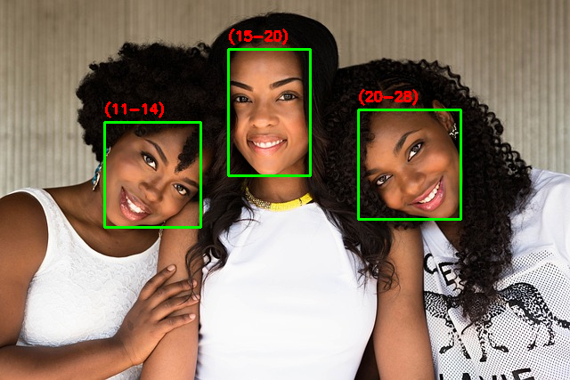

:cyclone:  Flask, OpenCV, Docker :cyclone: 

Using machine learning to recognize faces in the uploaded image. The application takes an image from the user and returns an image with faces marked with green squares 
+ age prediction(not too smooth with its prediction :D)

## RUN manual
```
$ sudo pip3 install -r requirements.txt
$ python app.py
```

## docker
```
$ sudo docker build -t reco .
$ sudo docker run -p 5000:5000 reco
```
